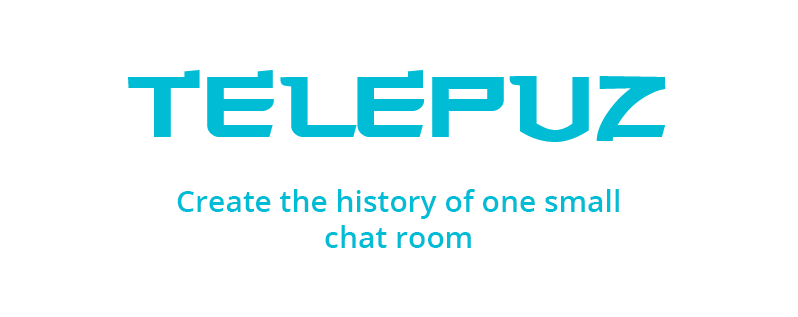

## Что такое Telepuz
Telepuz - это одна публичная комната-чат, в которой можно болтать с кем угодно и о чем угодно.

## Для чего разрабатывалось? 
Чат создавался в учебных и развлекательных целях

## Использование кода
Копируйте, изменяйте, дорабатывайте и берите полезные практики из приложения, мне не жалко :)

## Стек
В Telepuz применено много разных технологий и практик, которые используются для создание больших и качественных Android-приложений:
* **Kotlin** - язык программирования.
* **Custom View** - аватарки пользователей сделаны, как кастомная view, в которой прорисовывается цветной круг и текст на нем
* **MVVM (Model ViewModel Model)** - архитектура, на которой строится Telepuz. Позволяет разграничивать бизнес-логику и дизайн.
* **Dagger - Hilt** - фреймворк внедерения зависимостей, использован подмодуль Hilt для лучшей работы с ViewModel
* **WebSocket** - протокол передачи данных по TCP, позволяет передавать данные в live-режиме, не делая запроса на сервер.
* **MessagePack** - формат обмена данными между клиентом и сервером. Был выбран из-за ряды преимуществ: скорость сериализации/десериализации, меньший объем сериализованного объекта, чем у JSON

## Краткое описание работы программы
### Обмен данными между клиентом и сервером
Поверх WebSocket был написан **мини-протокол**, который вводит понятие метода и данных, отправляемых на этот метод. Так как WebSocket передает только байты, потребовалось разработать свой способ их сериализовывать.

* **Пул прослушиваемых методов** - специальный словарь, в который записываются коллбеки тех методов, которые мы хотим прослушать, когда реализовываем бизнес-логику.

Пример:

 `client.on("user.create", data)` - запускаем прослушивание метода, помещая его в пул всех методов. Когда сервер пришлет на `user.create` данные, мини-протокол найдет его в словаре и вызовет коллбек, отправляя в него ответ от сервера.

 * **Сериализатор MessagePack** - Был создан отдельный класс для сериализации/десериализации MsgPack, умеющий работать с пулом методов, а также форматом запросов/ответов, утвержденным на сервере.

---

## Кто разрабатывал?

Над приложением трудились два человека:

* [KerJen](https://github.com/KerJen) - разработчик Android-версии Telepuz.
* [undefined](https://github.com/undefined7887) - разработчик серверной части (Backend) Telepuz.

## Полезные ссылки
[Backend](https://github.com/undefined7887/telepuz-backend) - репозиторий серверной части на языке Go

## Контакты
* [KerJen - Антон Янкин](https://vk.com/kerjen)
* [undefined - Ярослав Евстафьев](https://vk.com/undefined7887)

